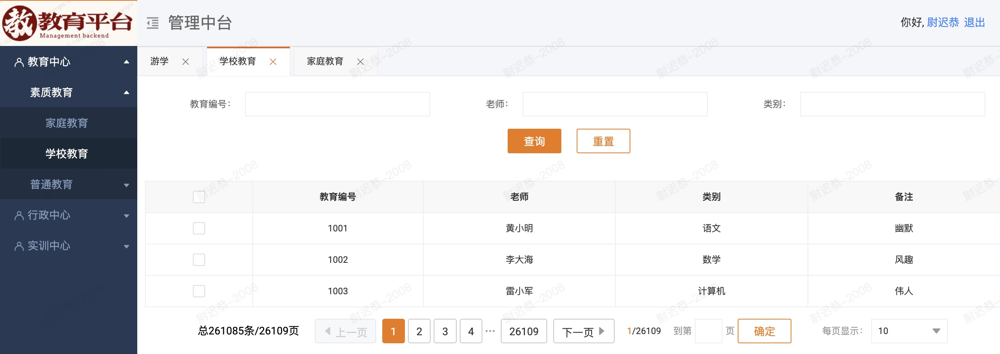

## 中台项目范例
项目设计说明：[设计一个中台项目架构](https://www.xnbz.site/blog/2022/01/13/Infrastructure/)

技术栈：`react16+webpack+dva+mock`

页面效果：

<!--  -->


## 使用

```s
# 推荐使用yarn安装，容错比较好
yarn
npm run mock
npm run local
```

浏览器访问：
```
http://localhost:2022
```
